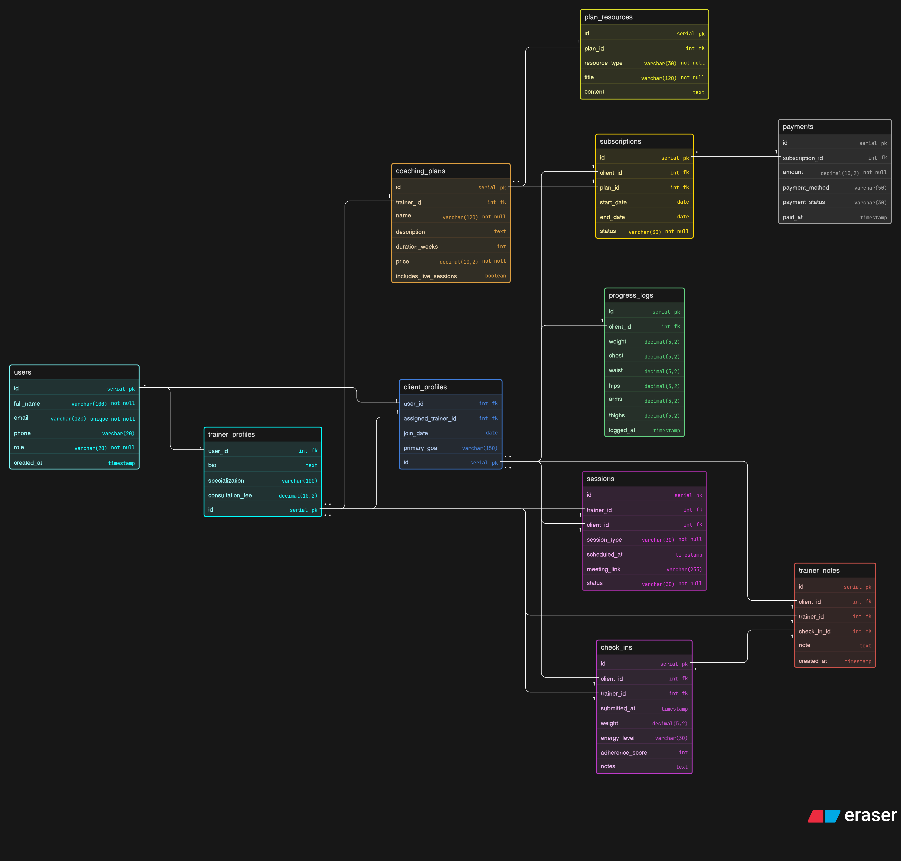

# Fitness-Influencer-Coaching-Platform-DB-Design

# Mental Map

-- User Onboarding Flow

1. person joins platform →
   create users record

2. choose role →
   trainer / client / admin

3. if trainer →
   create trainer_profiles

4. if client →
   create client_profiles
   optionally assign trainer

-- Plan Purchase Flow

1. trainer creates coaching plan

2. plan can include:
   - workout routine
   - diet guidance
   - live sessions
   - consultation support

3. client buys plan →
   create subscriptions row

4. payment recorded

5. coaching starts

-- Consultation Flow

1. client books session

2. create sessions row:
   - trainer_id
   - client_id
   - session_type
   - scheduled_at
   - meeting_link
   - status

3. complete session later

-- Progress Flow

1. client submits weekly check-in

2. store:
   - weight
   - body notes
   - energy
   - adherence

3. trainer adds feedback

-- Measurement Tracking

1. client logs measurements

2. store:
   - weight
   - chest
   - waist
   - hips
   - arms
   - thighs
